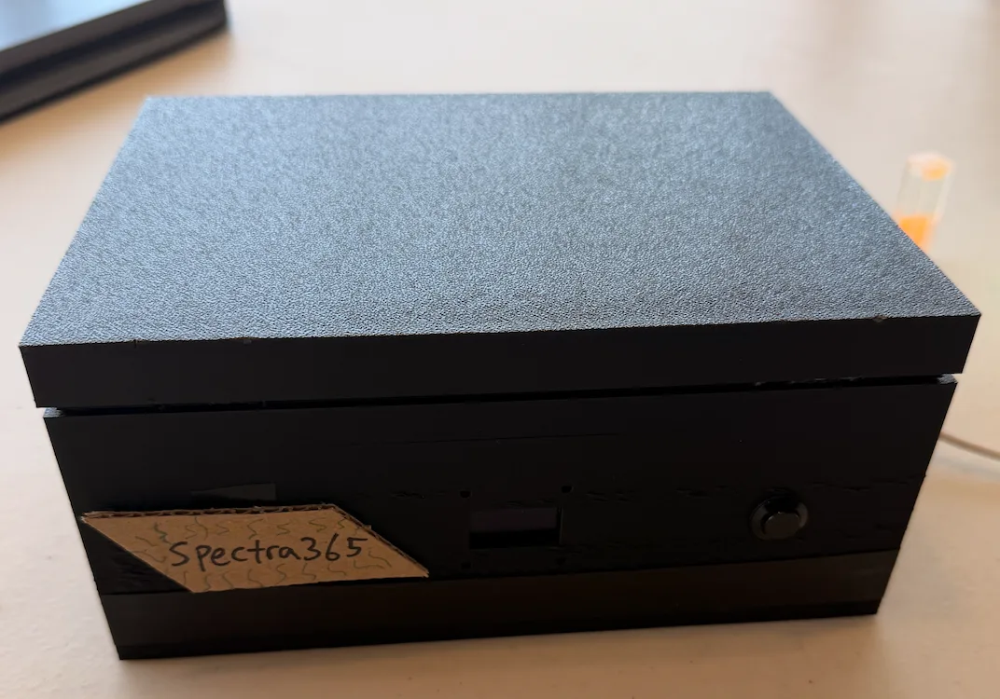

This page is dedicated to the personal projects I have done over the years. These projects reflect my interests in engineering, robotics, and figures. From independent experiments to collaborative work, each project represents a step in my growth as a student and creator.

*Click each project title to view its poster, paper, or related materials.*

---

<h2 style="margin-bottom: 5px;">AgriVision</h2>

<h2 style="margin-bottom: 5px;">
  <a href="https://drive.google.com/file/d/1SYp8Jrdz3xWtcf4ardse8WKeJ6jwZSGA/view"
     style="text-decoration: none; color: inherit;">
    Affordable AS7341-Based Multispectral Fluorescence Emission Analyzer for High-School Laboratories and Independent Users - Brennan Park, Felix Wang, and Archith Karthik
  </a>
</h2>

  

    For my final capstone project at the Engineering Summer Academy at Penn, nanotechnology track, my teammates and I created an affordable multispectral fluorescence emission analyzer by utilizing the AS7341 sensor. Laboratory spectrometers tend to cost anywhere between $1,000 and $70,000 dollars, which is very likely out of the budget of most schools or individual scientists. Hence, we created an affordable spectrometer, which costs about $200. We are currently in the process of writing a paper under the supervision of Dr. Gyuseok Kim at the University of Pennsylvania. <b>(07/2024 - 08/2026)</b>

<h2 style="margin-bottom: 5px;">
  <a href="https://drive.google.com/file/d/1SYp8Jrdz3xWtcf4ardse8WKeJ6jwZSGA/view"
     style="text-decoration: none; color: inherit;">
    CdSe Quantum Dots
  </a>
</h2>

  

    A book/compilation of some of my favorite proofs and proofs that I find to be essential. I started this project back in my freshman year of high school, and I continue to add to it whenever I learn something interesting or new. The book was created in Overleaf with LaTeX. <b>(11/2024 - 11/2026)</b>

<h2 style="margin-bottom: 5px;">
  <a href="https://drive.google.com/file/d/1Lhq-FwRly7wlgx8qRTpLkb22dewvhWSQ/view"
     style="text-decoration: none; color: inherit;">
    Water Rocket Flight Simulator
  </a>
</h2>

  

    Originally assigned as a physics SBE lab that required only the construction and launch of a water bottle rocket. I expanded the project into an interactive, Python-based flight-optimization tool. The program allows users to adjust water fill percentage, launch pressure, and rocket mass, then simulates the rocket's flight. It also compares ideal and realistic drag-based flight models. Overall, this was a really fun project to do, as it allowed me to play around with applied physics and coding. <b>(05/2025 - 06/2025)</b>
  

  <video width="300" autoplay loop muted playsinline>
    <source src="../assets/gif/RocketGif.mp4" type="video/mp4">
  </video>

<h2 style="margin-bottom: 5px;">
  <a href="https://drive.google.com/file/d/1SYp8Jrdz3xWtcf4ardse8WKeJ6jwZSGA/view"
     style="text-decoration: none; color: inherit;">
    Mathematical Proofs
  </a>
</h2>

  

    A book/compilation of some of my favorite proofs and proofs that I find to be essential. I started this project back in my freshman year of highschool and I continue to add to it whenever I learn something interesting or new. The book was created in Overleaf with LaTeX. <b>(11/2024 - 11/2026)</b>

<h2 style="margin-bottom: 5px;">
  <a href="https://drive.google.com/file/d/1Lhq-FwRly7wlgx8qRTpLkb22dewvhWSQ/view"
     style="text-decoration: none; color: inherit;">
    Pacing Assistant System for Visually Impaired Swimmers
  </a>
</h2>

I designed a model of a pacing assistant system for visually impaired swimmers that enables independent lane navigation and consistent stroke rhythm without relying on traditional tapper assistance. The device integrates real-time distance sensing with timed feedback to an app, providing coaches with immediate data. The invention is currently in the patent application process. <b>(04/2025 - 06/2025)</b>

<h2 style="margin-bottom: 5px;">
  <a href="https://www.roboshare.kr/"
     style="text-decoration: none; color: inherit;">
    Roboshare
  </a>
</h2>

Co-founder and the head of Marketing & Branding of Roboshare. RoboShare is a student-led non-profit initiative that unites aspiring roboticists across Korea to collaborate on VEX robotics and broader engineering projects. By creating an accessible space for knowledge exchange, design feedback, and peer mentorship, the platform empowers students to accelerate innovation. <b>(06/2025 - present)</b>

