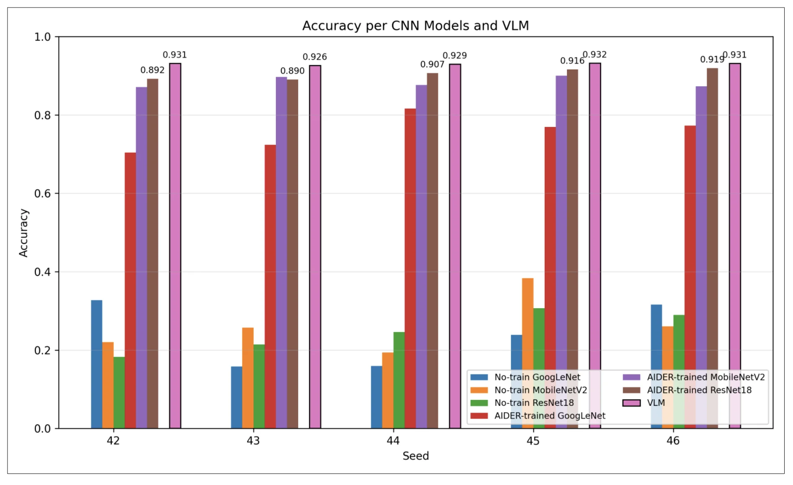
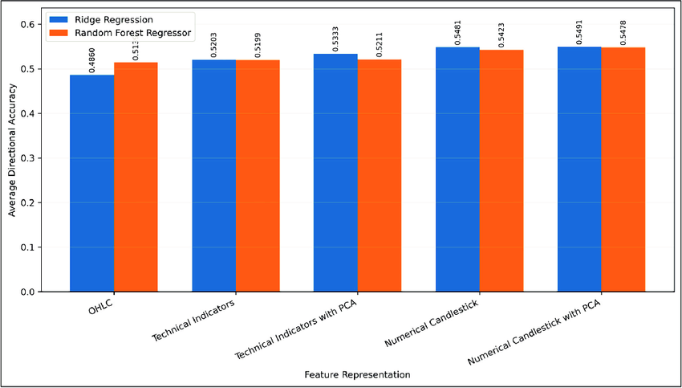

This section of my portfolio is meant to be an archive of my research papers, ranging from non-rigorous to rigorous studies. Each project reflects my curiosity in exploring practical and thought-provoking solutions through research.

*Click each project title to view its poster, paper, or related materials.*

---
<h2 style="margin-bottom: 5px;">
  <a href="https://drive.google.com/file/d/1KiochZ-RqdEu8X_LWzlDm4PUDua_BN14/view"
     style="text-decoration: none; color: inherit;">
    Using an On-Device VLM-Based Edge Computing System for Real-Time Disaster Detection - Brennan Park
  </a>
</h2>

I developed an on-device edge computing system for real-time disaster detection using Vision-Language Models (VLMs) as an alternative to conventional CNN-based approaches. By comparing ImageNet-pretrained CNNs, fine-tuned CNNs, and the zero-shot VLM Gemma3-4B on the AIDER disaster dataset, I evaluated the feasibility of VLM-based edge inference on a Raspberry Pi 5 under five different seed conditions. <b>(04/2025 - 01/2026)</b>

<h2 style="margin-bottom: 5px;">
  <a href="https://ajosr.org/wp-content/uploads/journal/published_paper/volume-4/issue-4/ajsr2026_HHqKq4RY.pdf"
     style="text-decoration: none; color: inherit;">
    Numerical Features from Candlestick Chart Structures for ETF Return Prediction: A Comparison with OHLC Prices and Technical Indicators - Brennan Park
  </a>
</h2>

  

    
This paper studies how explicitly encoding relative price relationships can improve how financial data is represented for machine-learning models. By developing eight numerical features that translate candlestick chart structures into quantitative inputs for predicting short-term ETF returns, I compared their performance with raw OHLC prices and traditional technical indicators across eight major U.S. ETFs. The candlestick-based representations generally achieved lower prediction errors and higher directional accuracy, suggesting that transforming existing price data into relative and normalized features may provide models with a more effective input representation. The paper was later published and accepted by the American Journal of Student Research. <b>(12/2025 - 08/2026)</b>

    
DOI: 10.70251/HYJR2348.44903920

  

  

<h2 style="margin-bottom: 5px;">
  <a href="https://drive.google.com/file/d/1KiochZ-RqdEu8X_LWzlDm4PUDua_BN14/view"
     style="text-decoration: none; color: inherit;">
    HiMCM 2025 Report - Brennan Park, Connor Seoung, Jion Choi, Jun Yi
  </a>
</h2>

We developed a mathematical model to optimize emergency evacuation sweep strategies in multi-use buildings during hazards. Using deterministic path planning and stochastic simulations inspired by Close Quarters Battle methods, we analyzed how factors like room size, occupancy, and building layout affect sweep efficiency. <b>(11/2025)</b>

