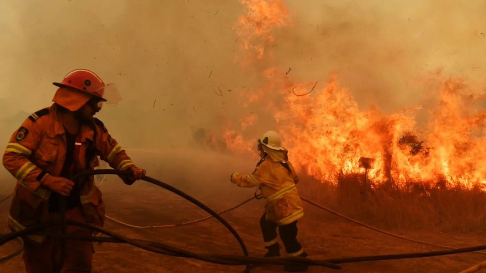

This section of my portfolio contains my research projects, ranging from random experiments to more academic work. Each project reflects my curiosity in exploring practical and thought-provoking topics through research.

---
**HiMCM 2025 Report (16953) - Brennan Park, Connor Seoung, Jion Choi, Jun Yi (11.25 - 11.25)**

- We developed a mathematical model to optimize emergency evacuation sweep strategies in multi-use buildings during hazards. Using deterministic path planning and stochastic simulations inspired by Close Quarters Battle methods, we analyzed how factors like room size, occupancy, and building layout affect sweep efficiency.

[Paper for the HiMCM 2025 Report](https://drive.google.com/file/d/1KiochZ-RqdEu8X_LWzlDm4PUDua_BN14/view)

---

<button onclick="this.parentElement.style.display='none'" style="
position: absolute;
top: 10px;
right: 14px;
background: none;
border: none;
color: white;
font-size: 28px;
cursor: pointer;
">
×
</button>

Click each project title to view its poster, paper, or related materials.

